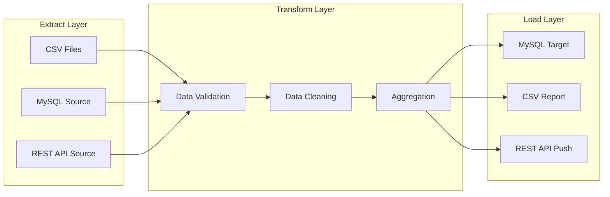

# Python ETL Pipeline

[](https://www.python.org/)
[](https://fastapi.tiangolo.com/)
[](https://pandas.pydata.org/)
[](LICENSE)

> A **modular Python ETL (Extract-Transform-Load) pipeline** built for enterprise data integration tasks. Supports multiple source connectors, configurable transformation rules, and flexible load targets. Inspired by real data pipeline work in ERP, retail analytics, and AI/ML data preparation.

---

## Pipeline Architecture



---

## Project Structure

```
python-etl-pipeline/
├── etl/
│   ├── extractors/
│   │   ├── base_extractor.py
│   │   ├── csv_extractor.py
│   │   ├── mysql_extractor.py
│   │   └── rest_extractor.py
│   ├── transformers/
│   │   ├── validator.py
│   │   ├── cleaner.py
│   │   └── aggregator.py
│   ├── loaders/
│   │   ├── mysql_loader.py
│   │   └── csv_loader.py
│   ├── pipeline.py
│   └── config.py
├── pipelines/
│   ├── sales_sync.py
│   └── inventory_report.py
├── requirements.txt
└── README.md
```

---

## Tech Stack

| Component | Library | Purpose |
|-----------|---------|---------|
| Data Processing | Pandas 2.0 | DataFrame operations |
| Validation | Pydantic v2 | Schema validation |
| DB Connector | SQLAlchemy 2.0 | MySQL/MariaDB |
| HTTP Client | httpx | Async REST API extraction |
| Scheduling | APScheduler | Cron pipeline scheduling |
| API | FastAPI | Pipeline trigger endpoints |

---

## Getting Started

```bash
git clone https://github.com/asad4230/python-etl-pipeline.git
cd python-etl-pipeline
pip install -r requirements.txt
cp .env.example .env
python -m pipelines.sales_sync
```

---

## Usage Example

```python
from etl.pipeline import Pipeline
from etl.extractors import MySQLExtractor
from etl.transformers import Validator, Cleaner, Aggregator
from etl.loaders import MySQLLoader

pipeline = Pipeline(name="sales_sync")
pipeline.add_extractor(MySQLExtractor(query="SELECT * FROM sales WHERE date >= :since", params={"since": "2026-01-01"}))
pipeline.add_transformer(Validator(schema=SaleSchema))
pipeline.add_transformer(Cleaner(drop_duplicates=["order_id"]))
pipeline.add_transformer(Aggregator(group_by=["branch", "date"], agg={"total": "sum"}))
pipeline.add_loader(MySQLLoader(table="sales_summary", mode="upsert"))
result = pipeline.run()
print(f"Processed {result.rows_loaded} rows in {result.duration:.2f}s")
```

---

## Real-World Use Cases

- **Retail platform**: Syncing sales data from 145+ branches to central analytics
- **ERPNext integration**: Exporting Frappe doctype data to external reporting tools
- **AI/ML prep**: Cleaning and preparing CCTV event data for YOLO model training

---

Built by [Asad Mushtaq](https://github.com/asad4230) · Solution Architect & Tech Lead · 11+ Years
